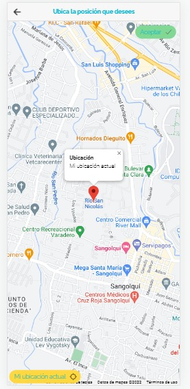

## Proyecto Bimestral || Aplicaciones Móviles  

### Integrantes:
- Armas Alejandro
- Catota Luis
- Guala Paul
- Guallichico Nataly

## Descripción
Aplicación desarrollada en Ionic para fomentar el Turismo la ciudad de Quito. Consta de tres roles principapes: Turistas, Propierarios y Administrador.  
El usuario Turista puede visualizar los lugares turísticos registrados por el usuario Propietario y Administrador. Además, los sitios están registrado por categorías, como parques, iglesias, monumentos, etc.

  

## Instalación

Este manual describe los pasos necesarios para que cualquier persona pueda
realizar la instalación del aplicativo móvil. El manual presenta las especificaciones mínimas de hardware y software para la correr el aplicativo
1. REQUERMINIENTOS TÉCNICOS
 - 1.1. Requerimientos de hardware
Procesador: Quad core o superior
Memoria RAM: 1GB o superior
 - 1.2. Requerimientos de software
Sistema Operativo: Android 4.4 o superior
2. HERRAMIENTAS PARA EL DESARROLLO
- 2.1. Ionic Framework
Es un SDK de frontend de código abierto para desarrollar aplicaciones híbridas basado en tecnologías web (HTML, CSS y JS), nos permite desarrollar aplicaciones para iOS nativo, Android y la web   

## Proceso
Para la instalación del aplicativo móvil es necesario seguir los siguientes pasos: 
1. Activar el modo de desarrollador desde el dispositivo móvil, previamente debemos entrar en ajustes, seguridad y seleccionar la opción “Fuentes Desconocidas” lo cual le permitirá al dispositivo reconocer el archivo .apk y permitir su instalación
2. Descargamos el archivo “turisapp.apk” que contiene el ejecutable de la aplicación y . Una vez realizado, seleccionar el archivo y se instalara en el dispositivo.  

   

## Componentes

### Administrador
La funcionalidad del usuario administrador para realizar operaciones CRUD con los sitios turísticos almacenados se encuentra dentro del directorio <em>app -> backend -> set-sitiosturisticos</em>, como indica la siguiente imagen:

  

Interfaz del perfil <em>Administrador</em>  
  

Operaciones CRUD para los sitios turísticos almacenados  

Las siguientes imágenes reflejan el almacenamiendo de las imágenes sobre los sitios turísticos en la base de datos de Firestore:

  

  

 

### Propietario
El usuario <em>Propietario</em> almacena los sitios turísticos que podrán ser visualizados por los usuarios <em>Turistas</em>.  
Las funcionalidades del usuario se encuentran dentro del directorio <em>pages -> registrarsitiosturisticos</em>  

  

Interfaz del perfil del <em>Propietario</em>:   

  

Funcionalidades del usuario: 

  

Registro de un sitio turístico mediante la API de Google Maps:  

  

 

### Turista

El usuario únicamente puede visualizar los sitios registrados por el usuario <em>Propietario</em>, y agregarlos a su lista de sistios favoritos. Las funcionalidades correspondientes a su rol se encuentran dentro de la siguiente ruta: <em>pages -> visitarsitiosturisticos</em> 

  

Interfaz con las funcionalidades del usuario <em>Turista</em>:  

  

Visualización de los sitios turísticos registrados por el usuario <em>Propietario</em>:

  

Visualización en Google Maps de la ubicación turística seleccionada: 

  

   

  

### Enlaces

['Hosting de la aplicación'](https://turismo-guia.web.app/)  
['Presentación en Youtube'](https://youtu.be/jr3D0YbSQms)

